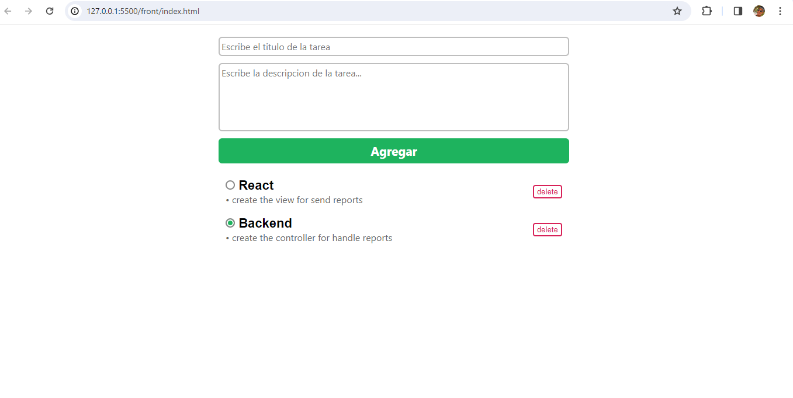

# A simple htmx example with handlebars

This is a simple example of how to use htmx, a pretty good library to save you several lines with javascript. Of course this is not all that can be done with htmx and it can even be more powerful when used with other frameworks such as astro.

# Installation

Very simple, clone the repository with:
```git
git clone https://github.com/ajorgenmarten/htmx-example.git
```
htmx-example.git, then enter the `/api` folder of the project and install the dependencies with:
```npm
npm install
```
then all that remains is to run the backend with: 
```npm
npm run start
```
and open the `index.html` in the `/front` folder.


## Screenshots

